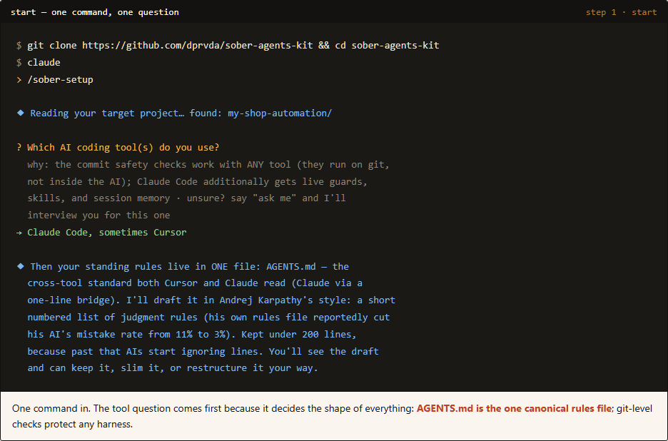
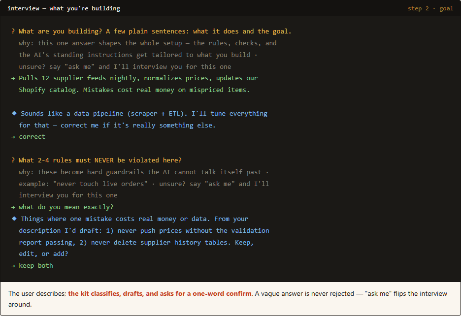
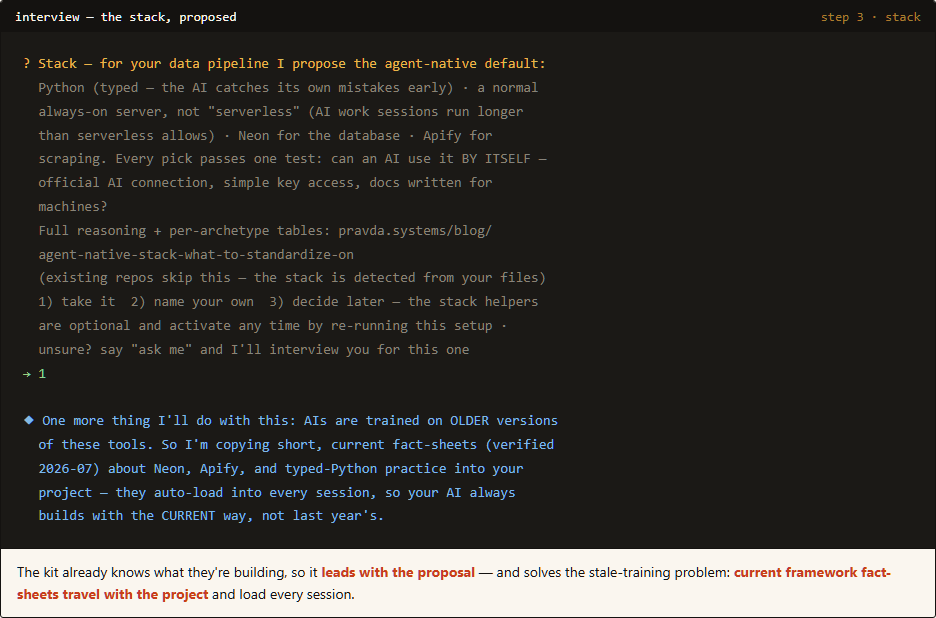
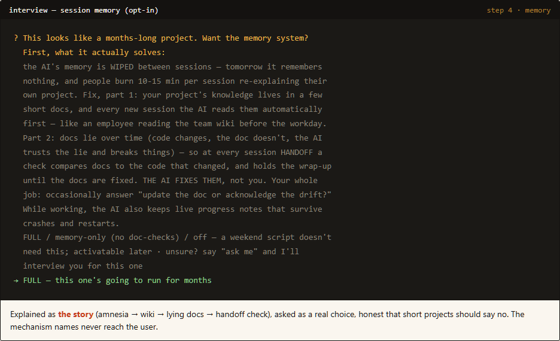
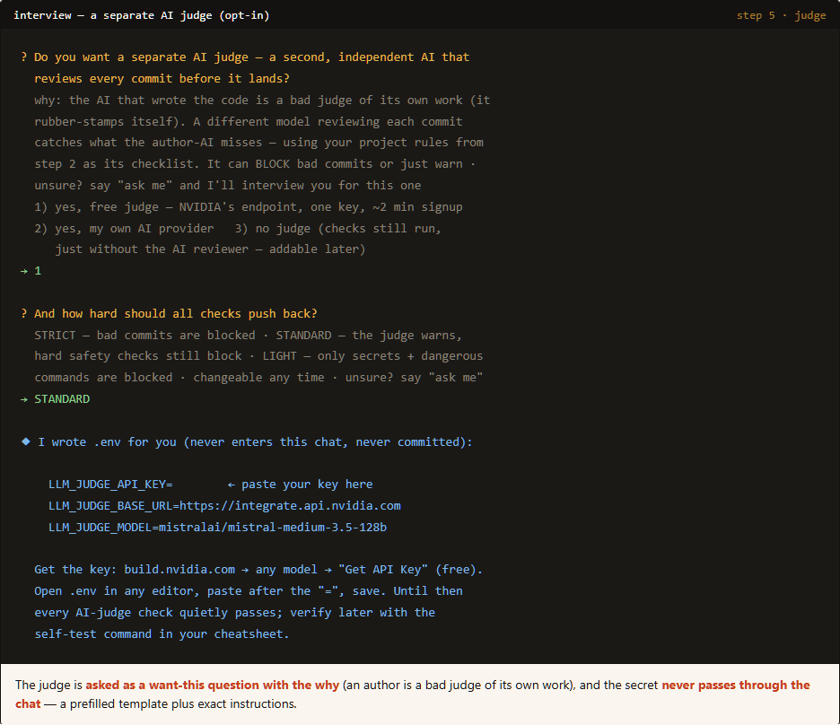
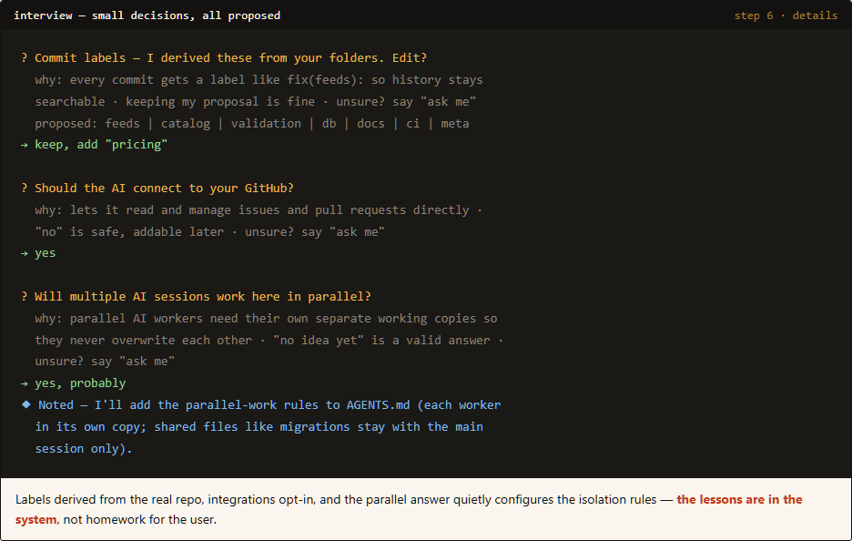
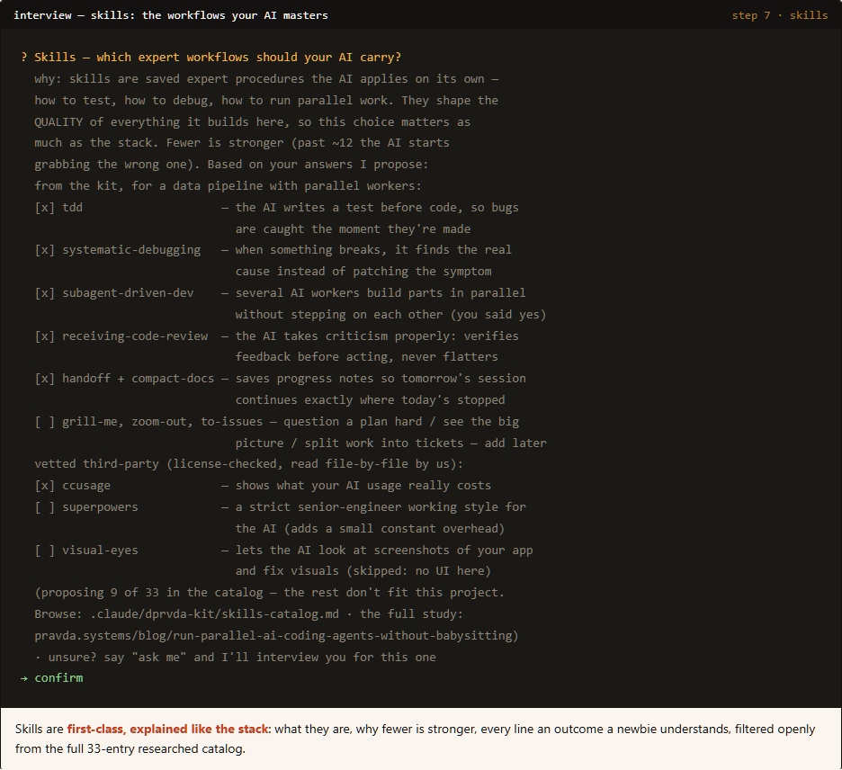
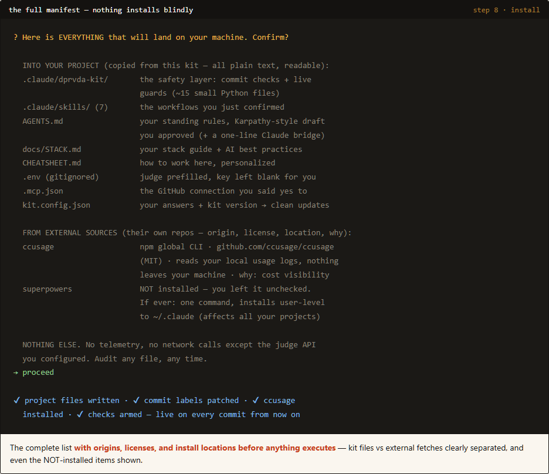
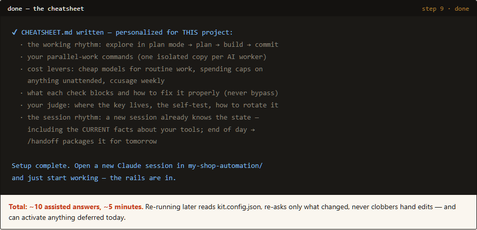

# sober-agents-kit

**One command sets up a disciplined AI-coding project: safety gates, an independent AI judge,
session memory, and a curated skill set — through a guided interview where nothing installs
blindly.**

```bash
git clone https://github.com/dprvda/sober-agents-kit && cd sober-agents-kit
claude
> /sober-setup
```

The setup interviews you (~5 minutes, every question explained in plain words, "ask me" flips any
question into a mini-interview), proposes everything from your answers, shows the full manifest of
what will land on your machine, and only then installs. Works with Claude Code fully; the commit
safety gates are git-level and protect **any** AI tool (Cursor, Codex, …).

## The setup, step by step (what you'll actually see)

| | |
|---|---|
| **1 · Start.** One command; the tool question decides the shape (AGENTS.md as the one canonical rules file, drafted in Andrej Karpathy's short-rules style). |  |
| **2 · Goal.** Describe what you're building in plain sentences — the kit classifies it, drafts your never-violate rules, you confirm. |  |
| **3 · Stack.** The kit leads with the agent-native default for your kind of project — take it, name your own, or decide later. |  |
| **4 · Session memory (opt-in).** For long projects: docs the AI auto-reads every session, live progress notes, and a handoff-time check that keeps docs from lying. The AI maintains it, not you. |  |
| **5 · The AI judge (opt-in).** A second, independent AI reviews every commit — free provider available; your key never passes through chat. |  |
| **6 · Details.** Commit labels derived from your folders, integrations opt-in, parallel-work rules configured from one question. |  |
| **7 · Skills.** The workflows your AI masters — proposed from your answers, filtered from a 33-entry researched catalog, every line in plain words. |  |
| **8 · The manifest.** EVERYTHING that will land on your machine — kit files vs external fetches, origins, licenses, install locations — before anything executes. |  |
| **9 · Done.** A personalized CHEATSHEET.md: how to work here, day one. |  |

Interactive version: open [`docs/setup-flow-demo.html`](docs/setup-flow-demo.html) in a browser.

Prefer the non-interactive path? `python install.py --target /path/to/repo [--python|--rust]` does
the copying without the interview (see [INSTALL.md](INSTALL.md)); you then fill the placeholders by
hand.

## Why

Left alone, an autonomous coding session will eventually force-push under pressure, `--no-verify`
past a failing hook, let docs drift, or re-introduce a removed code path. This kit turns "what an AI
*thinks* it should do" into "what the repo *allows*" — each gate targets a specific real failure mode.

## What's inside

Everything the kit installs lives under a single namespaced folder, **`.claude/dprvda-kit/`**, so it
can't collide with another kit a collaborator might also use. Only files that external tools *require*
at the repo root (`CLAUDE.md`, `.pre-commit-config.yaml`, …) sit at the root.

```
your-repo/
├─ CLAUDE.md                 # rules-only, loaded every session (fill-in placeholders)
├─ README-CLAUDE.md          # the full setup manual
├─ AGENTS.md  .gitmessage  .pre-commit-config.yaml  .mcp.json  .env.example
└─ .claude/
   ├─ settings.json          # wires the hooks below
   ├─ skills/                # /handoff /tdd /grill-me /caveman /to-issues /zoom-out …
   └─ dprvda-kit/            # ← all kit machinery, namespaced
      ├─ hooks/              # Claude Code tool hooks (git-safety, rule re-inject, MCP nudges)
      ├─ gates/              # pre-commit gates + run_gates_parallel.py + prompts/ (editable judge prompts)
      ├─ inject_context_docs.py   # SessionStart context injector
      └─ docs/               # context-framework.md, parallel-agents.md
```

### The three layers
1. **Claude Code hooks** (`.claude/dprvda-kit/hooks/`) — physically block dangerous git ops, run the
   AI judge before a script launches, re-inject `CLAUDE.md` rules on every commit.
2. **Pre-commit gates** (`.claude/dprvda-kit/gates/`) — `check_file_reason`, `check_links`,
   `check_doc_freshness`, `check_md_size`, `check_secrets`, and the optional `critic_llm` AI judge,
   run by a 2-phase dispatcher. A self-defending canary protects the doc-freshness gate.
3. **Conventions** (`CLAUDE.md` + the skills) — short rules file refreshed every commit, plus
   reusable multi-step workflows.

### Optional modules (skip with installer flags)
- **AI judge** — `critic_llm` reviews each staged file via an OpenAI-compatible API (defaults to
  DeepSeek). Key via a plain `.env` (`LLM_JUDGE_API_KEY`); **blank key ⇒ it soft-passes**, so it's
  safe to leave off.
- **MCP** — `.mcp.json` for serena (code intel) + GitHub, with soft "use the MCP tool" nudges.
- **Language packs** — `packs/rust/` (cargo-audit, cargo-vet, binary-secrets), `packs/python/` (ruff).

### Seeds (`seeds/`)
Copy-paste starting points for your **global** `~/.claude/CLAUDE.md`: universal discipline rules, a
user-profile template, portable engineering lessons (Windows/git-bash/WSL gotchas, git-commit
discipline, agent-orchestration rules).

## Quick start

**Into an existing repo:**
```sh
git clone <this-repo> sober-agents-kit
cd sober-agents-kit
python install.py --target /path/to/your-repo --rust          # or: ./install.sh / .\install.ps1
```

**As a GitHub template** (new repo):
```sh
gh repo create my-new-repo --template <owner>/sober-agents-kit
cd my-new-repo
python install.py --here
```

Then fill in the `<!-- FILL IN -->` sections of `CLAUDE.md`, optionally put `LLM_JUDGE_API_KEY` in
`.env`, and open the repo in Claude Code. Full options, key setup, and troubleshooting:
[`INSTALL.md`](INSTALL.md).

## Customizing
- **Judge prompts** are plain markdown in `.claude/dprvda-kit/gates/prompts/` — edit freely.
- **Gate tiers / exempt dirs / commit scopes** are constants at the top of each gate — edit to taste.
- **Rename the kit** (`--kit-name`) if you want a different namespace; the installer rewrites refs.
